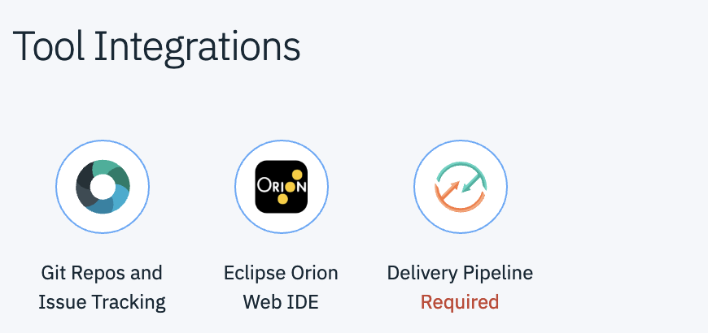
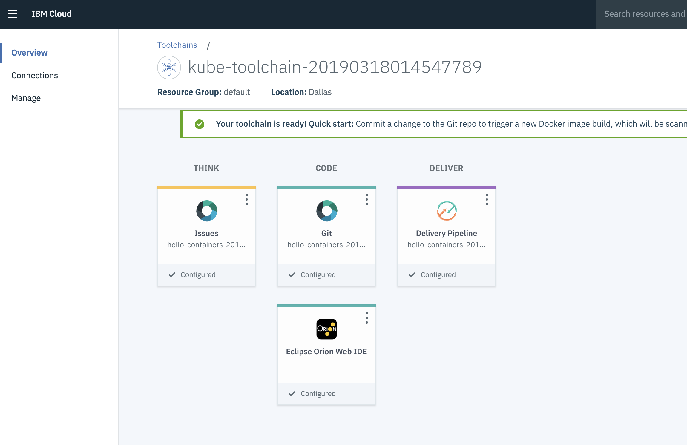

# Lab Devops: Fazendo deploy de uma aplicação utilizando IBM Continuous Delivery


Nesse lab, você aprenderá como fazer o deploy de uma aplicação utilizando a IBM Continuous Delivery através da criação de uma Toolchain. 

# Pré Requisitos
Esse lab utiliza os seguintes serviços:

- IBM Cloud Container Registry
- Kubernetes Services
- Continous Delivery

# 1. Criando sua Toolchain

Uma toolchain é um grupo de ferramentas integradas para desenvolvimento, monitoração e mais. Você pode criar sua toolchain do zero ou se basear em um template. Criaremos neste exercício uma Toolchain baseado em um Template.

1. Faça login em [cloud.ibm.com](https://cloud.ibm.com) com o seu usuário e senha.

2. Acesse o menu Catálogo e procure pelo componente ***Continuous Delivery***. Clique em Continuous Delivery. Ele irá criar no seu namespace um repositório de uma aplicação básica chamada `hello-container`.


Esse template vem com 3 tools:

`Git Repos`
- Para pegar a aplicações do repositório Git

`Eclipse Orion Web IDE`
- Com esssa tool você é capaz editar sua aplicação a partir do portal

`Delivery Pipeline`
- Esteira de deploy com 3 stages, Build, Validate e Deploy.

3. Selecione a região desejada (Dallas) e clique no botão "Create". Neste momento você será apresentado a um "Getting Started" com informações iniciais sobre o Continuous Delivery.

4. Selecione o menu na parte superior esquerda (Hamburger Menu) e Selecione a opção ***Devops***.

5. Na parte superior da tela Selecione a localidade "Dallas".

6. Clique no botão "Create a Toolchain".

7. Clique na opção "Develop a Kubernetes app".


8. Manter as informações iniciais e clicar em "Delivery Pipeline".


9. Na seção "IBM Cloud API Key", clicar no botão "Create" para criar uma nova API e confirmar a criação da API Key no Pop-up apresentado.

10. No Campo "Container registry namespace" digitar um nome único na IBM Cloud. Será criado um Container Registry com o nome digitado neste campo. Manter os demais campos com os valores padrão e clicar no botão "Create".

Assim que sua toolchain estiver pronta, ela iniciará automaticamente fazendo o deploy da sua aplicação `hello-container` no cluster Kubernetes previamente criado. Posteriormente você pode iniciar sua delivery pipeline de duas maneiras, ativando manualmente ou atualizando seu repositório.

Para verificar os stages, clique na tool `Delivery Pipeline` e cheque se todos os estágios foram executados com sucesso. No ultimo stage (Prod), na área de jobs é possível visualizar os logs de execução. No fim do log de deploy, você encontrará o link com IP do seu worker node e a porta para acessar sua aplicação.

Pronto, deploy feito!

# 2. Alterando o código e realizando o redeploy da aplicação

Nesta seção iremos alterar o código da aplicação, comitar a alteração no Git e verificar a execução da esteira de Devops.

1. Selecione o menu na parte superior esquerda (Hamburger Menu) e Selecione a opção ***Devops***.

2. Na parte superior da tela Selecione a localidade ***"Dallas"***.

3. Clique na ToolChain que acabou de criar no exercício anterior.

4. Clique no ícone "Eclipse Orion Web IDE".



5. Clicar no arquivo "app.js" e alterar a string na linha abaixo para uma mensagem qualquer:
```
res.send('Welcome to IBM Cloud DevOps with Docker. Lets go use the Continuous Delivery Service');
```

6. Clicar no menu "File" e "Save" para salvar as alterações.

7. Clicar no ícone "Git" do lado esquerdo da tela.

8. Digitar um comentário no campo "Commit message" e clicar no botão "Commit".

9. Clicar no botão "Push" para subir as alterações. Pronto, o código foi alterado e as informações foram atualizadas no repositório Git.

10. Retornar ao Toolchain e verificar que a esteira Devops começou a ser executada de forma automática. Ao terminar os três passos (Build, Validate, Prod) a aplicação foi atualizada.

Pronto, Atualização realizada com sucesso! Você poderá verificar isso acessando a mesma URL fornecida no exercício anterior.
